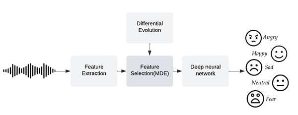
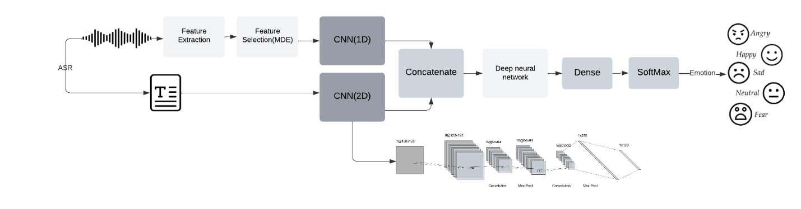

# Persian Speech Emotion Recognition (SER)

## 🔥 Overview
Understanding emotions in speech is crucial for natural human-computer interaction. However, accurately capturing emotions—especially in low-resource languages like Persian—poses significant challenges. This project introduces a **multimodal Speech Emotion Recognition (SER) system** that integrates **acoustic and textual features** to enhance emotion classification accuracy.

### 🎯 Key Contributions
- **Multimodal Fusion:** Combines **acoustic** and **textual** features for improved recognition.
- **Whisper ASR:** Converts speech to text for extracting linguistic features.
- **Modified Differential Evolution (MDE):** Optimized feature selection technique.
- **Self-Attention Mechanism:** Enhances the fusion of extracted features.
- **Deep Learning-based Classification:** Leverages CNN and Transformer-based architectures.

## 📌 Dataset
We evaluate our model on the **ShEMO (Sharif Speech Emotion) dataset**, a well-established Persian speech emotion corpus.

## 📊 Model Architecture
### 🔹 Feature Extraction
- **Acoustic Features:** MFCCs, spectral descriptors, and LLDs
- **Text Features:** Speech-to-text conversion using Whisper ASR, followed by tokenization and embedding

### 🔹 Feature Selection
- **Modified Differential Evolution (MDE)** optimizes feature selection, reducing dimensionality while improving classification accuracy.

### 🔹 Classification Model
- **CNN-1D** for acoustic feature extraction.
- **CNN-2D** for textual feature processing.
- **Self-Attention Mechanism** to enhance multimodal fusion.
- **Final Emotion Classification** via a deep learning-based model.

## 📈 Results
| Model | Accuracy |
|--------|---------|
| Baseline Acoustic Model | 74.5% |
| Baseline Text Model | 76.8% |
| **Proposed Multimodal Model** | **82.3%** |

## 🛠️ Requirements
- Python 3.7+
- PyTorch / TensorFlow
- Hugging Face Transformers
- Whisper ASR

## 📬 Contact
For questions or collaborations, reach out via esmaeilimobina98@gmail.com or open an issue on GitHub!

---
🎯 **Keywords:** Speech Processing, Emotion Recognition, Differential Evolution, Multimodal Learning

